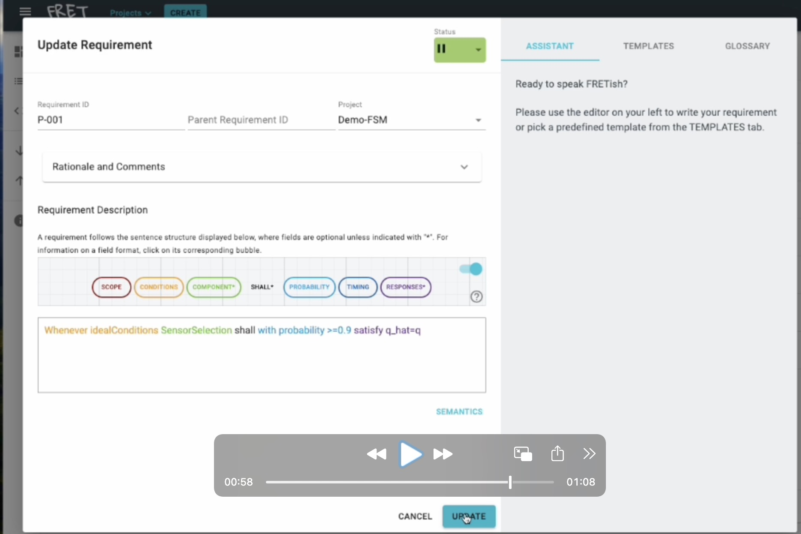

FRET: Formal Requirements Elicitation Tool
=============================================

Introduction
------------

FRET is a framework for the elicitation, specification, formalization, and analysis of (probabilistic and non-probabilistic) system requirements. It enables users to specify unambiguous requirements using restricted English sentences while providing multiple representations to enhance clarity and validation of semantics. These representations include natural language descriptions and formal logics, allowing users with different expertise to review and understand the precise meaning of each requirement.

We extended the structured natural language used by NASA's Formal Requirement Elicitation Tool (FRET) to support the specification of intuitive but unambiguous probabilistic requirements. Our tool present a formal, compositional, and automated approach for translating structured natural-language requirements into formulas in probabilistic temporal logic, and formally prove that the generated formulas are well-formed.

Installation
------------

See [installation guide](fret-electron/docs/_media/installingFRET/installationInstructions.md).

Troubleshooting
------------

See [troubleshooting](Troubleshooting.md).

Release notes
---------

See [release notes](https://github.com/NASA-SW-VnV/fret/releases).

Platforms
---------

FRET has been tested across a variety of architecture and operating system combinations. It has been validated on multiple versions and distributions of macOS, Linux and Windows.

Contributors
------------

List of contributors are anonymized during the accompanied paper review process.

License
-------
 
The FRET (Formal Requirements Elicitation) Tool is licensed under the Apache License, Version 2.0; you may not use this application except in compliance with the License. You may obtain a copy of the License [here](LICENSE.pdf).
 
Unless required by applicable law or agreed to in writing, software distributed under the License is distributed on an "AS IS" BASIS, WITHOUT WARRANTIES OR CONDITIONS OF ANY KIND, either express or implied. See the License for the specific language governing permissions and limitations under the License.

Copyright © 2025 (Anonymized organisation to be desclosed after review process concludes). All rights reserved.
